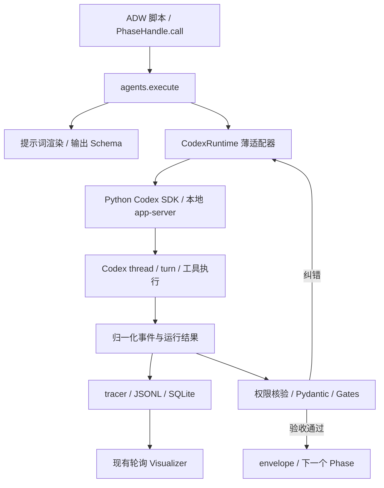

# SSSF：从 Pi 迁移到 Codex 的设计

状态：迁移设计稿；M0 已完成；M1、M2、M3 代码与确定性验收已完成。M3 的真实合成
smoke 已验证两个 child 的生命周期与只读无残留；逐 child 的 custom role 加载证明及真实完整
SDLC 因需要明确的数据外发和用量授权而待执行；M4 尚未实施。
核对日期：2026-09-21。M2/M3 证据见
[`codex-sdk-m2-report.md`](codex-sdk-m2-report.md) 与
[`codex-sdk-m3-report.md`](codex-sdk-m3-report.md)。

M0 的版本锁、真实能力验证、脱敏事件样本和未覆盖能力见
[`codex-sdk-m0-report.md`](codex-sdk-m0-report.md)。

本文中的“迁移 agent”指替换 ADW 节点使用的 coding-agent runtime。Python 继续负责工作流、重试、验收和 Git 提交；planner、builder、scout、reviewer、documenter 保留各自职责。

**采用官方 Python Codex SDK，通过一层薄适配器替换 Pi；继续使用现有 ADW / envelope / gates / SQLite 架构。迁移完成后的唯一运行时是 Codex，Pi 集成必须全部删除。**

用户明确不使用 Pi，因此不保留 Pi 后端、配置兼容层、历史事件解析器、会话转换、自动降级或回滚到 Pi 的能力。现有 Pi 实现只作为设计时的行为参考；完成迁移后，代码、模板、依赖和操作文档全部以 Codex 为准。

本文主体提出迁移设计；已完成的 M0 只增加隔离探针、报告和事件样本，不修改生产运行
代码，也不把 SDK 安装进项目或全局 Python。M0 的少量真实模型调用仅用于能力验证。

## 1. 当前实现与迁移边界

当前分支是工厂的分发包，没有已经安装到根目录的 `adws/`。实际修改对象在 `.claude/skills/sssf/`，之后由 `scripts/install.py` 安装到目标仓库。只修改一个已安装仓库的 `adw_modules`，不会完成本项目的迁移。

下表路径以 `.claude/skills/sssf/` 为基准。

| 当前位置 | 已确认的实现 | 迁移要求 |
|---|---|---|
| `templates/adws/adw_modules/agent_pi.py` | 启动 `pi -p --mode json`，解析 Pi 事件、模型目录和用量 | 新增 `agent_codex.py`，删除 `agent_pi.py` 及全部引用 |
| `templates/adws/adw_modules/agents.py` | 直接依赖 `PiRequest`、`PiResult`、`ToolCallTracker`；解析与 gate 失败后续问 | 保留验收循环；运行与事件转换交给适配器 |
| `templates/adws/adw_modules/data_types.py` | backend 枚举只有 `pi/claude_code`，用量结构以 Pi 为准 | 引入 Codex 配置和独立运行结果类型，删除 Pi 类型与旧 backend 取值 |
| `templates/adws/adw_modules/runner.py` | 保存 `agent_map.json`，累计 tokens/cost | 原子保存 thread 映射；区分未知费用与零费用 |
| `templates/adws/adw_modules/session.py` | 管理 ADW 生命周期和终止信号 | 增加运行时关闭、取消和遗留运行恢复 |
| `templates/adws/adw_modules/permissions.py` | 事后比较 Git 差异，处理越权改动 | 保留写入合同，修复检测与异常路径缺口 |
| `templates/harness_engineering/subagents.ts`、`themeMap.ts` | Pi 专属扩展和 TUI，子进程仍调用 `pi` | 删除这两个 Pi 扩展及安装引用，采用 Codex 子代理方案 |
| `templates/sssf.config.yaml`、`templates/env.sample` | Pi 工具名、混合供应商模型与 Pi 环境变量 | 发布 Codex 配置，删除 Pi 字段、环境变量和示例 |
| `templates/prompt_engineering/` | 报告合同、角色说明及 Pi 子代理工具名 | 更新运行时相关指令，保留角色和输出结构 |
| `templates/adws/adw_*.py`、`scripts/make_adw.py` | 每个脚本用 PEP 723 声明依赖 | 统一增加固定版本 SDK 依赖；生成器同步 |
| `templates/adws/adw_modules/tracer.py`、`apps/visualizer/` | SQLite 流水、工具事件、费用及上下文展示 | 统一 Codex 事件与统计口径，删除 Pi 解析和兼容分支 |
| `README.md`、`SKILL.md`、`cookbooks/`、`references/`、`templates/justfile` | 安装、配置、操作与恢复说明 | 与实际新行为同步 |

本次保持 ADW 调用入口 `ph.call(AgentCall(...))`、角色名称、工作流顺序和业务 envelope 字段。测试、质量检查和 commit 继续是 `kind="code"` 阶段。

`.claude/skills/sssf/` 是目前的分发位置，不是 Pi 的运行时目录。首轮保留该位置和现有安装命令；让 Codex 直接发现并调用这个管理 skill，属于分发入口适配，可单独实施，避免同时更改所有资源路径和 visualizer 启动路径。

## 2. 接入方式选择

官方 Python 包为 `openai-codex`，导入名为 `openai_codex`；官方文档已将它列为稳定版，Python 3.10+，底层使用本地 app-server，发布包携带匹配的 Codex runtime 依赖。[官方 Python SDK 文档](https://learn.chatgpt.com/docs/codex-sdk)

| 方案 | 与本项目的关系 | 决策 |
|---|---|---|
| Python Codex SDK | 与现有 Python 控制层一致，避免增加 Node 桥接服务 | 主方案 |
| `codex exec --json` | 很接近现有 subprocess 结构，但需要自行维护启动/恢复、流解析和取消路径 | 用于诊断与验证，不同时维护第二套生产驱动 |
| 手写 app-server 客户端 | 可直接控制协议，但连接、请求关联、server request 和版本兼容均需自行维护 | SDK 确有必要能力缺口时才重新评估 |
| TypeScript SDK | 可用，但本项目无需为 agent 运行增加 Node 依赖 | 不选 |
| 直接调用模型 API | 需要重建 coding-agent 工具执行与会话能力，超出替换 runtime 的范围 | 不选 |

`codex exec` 的 JSONL、结构化输出和指定 ID 恢复已由官方提供，适合作为隔离问题的诊断入口。[非交互模式文档](https://learn.chatgpt.com/docs/non-interactive-mode)

本机只读核对得到 `codex-cli 0.154.0`。这不是部署版本承诺：实施第一步要选定并锁定实际验证过的 SDK/runtime 组合，记录到发布清单。默认使用 SDK 配套 runtime；配置 `CODEX_PATH` 时必须重新检查兼容性，不能无条件使用 PATH 中任意版本。

## 3. 目标结构



职责明确分开：

- `agents.py`：角色解析、提示词、bounded retry、权限核验、envelope 和 gates。
- `agent_codex.py`：SDK 生命周期、thread/turn、配置转换、取消、运行错误。
- `codex_events.py`：将 Codex 消息转为 SSSF 事件与用量，保存原始消息。
- `data_types.py`：SSSF 自己的数据合同。SDK 类型不传播到 ADW 脚本。
- `tracer.py`：持久化和查询合同，不解释 Codex 协议。

只实现一个 Codex 后端，不建设通用插件框架或双后端过渡层。`coding_agent` 如保留为配置标识，只允许 `codex`；其他值通过统一 schema 校验拒绝，不设置 Pi 专用分发、转换或降级逻辑。旧实现可通过 Git 历史查阅，最终分发包不得保留 Pi 适配器。

建议的内部接口如下，名称属于 SSSF，不表示 SDK 已有同名函数：

```python
class CodexRuntime:
    def preflight(self, config: CodexRuntimeConfig) -> RuntimeCapabilities: ...
    def run_turn(self, request: AgentRunRequest, hooks: RuntimeHooks) -> AgentRunResult: ...
    def close(self) -> None: ...
```

`AgentRunRequest` 包含：角色、工作目录、模型、reasoning effort、角色指令、当前输入、输出 schema、可选 session 引用、权限合同和超时。

`AgentRunResult` 包含：`thread_id`、`turn_id`、最终文本、`completed/failed/interrupted` 状态、结构化错误、用量和可选上下文指标。失败也要保留已经收到的事件与用量，不能通过抛异常丢掉这些信息。

## 4. 会话、运行和恢复

### 4.1 ID 语义

Pi 接受调用方生成的 `sssf-...` session ID；Codex 的 thread ID 来自运行时。SSSF 保留自己的 `adw_id`，另存真实 `thread_id`，不得把 Pi ID 当作 Codex ID。

官方 app-server 提供创建、恢复、turn 输出约束、生命周期事件和取消接口；这里使用这些能力，但由适配器吸收协议与 SDK 差异。[App Server 文档](https://learn.chatgpt.com/docs/app-server)

建议 `agent_map.json` 升级为：

```json
{
  "schema_version": 2,
  "agents": {
    "builder": {
      "backend": "codex",
      "thread_id": "<runtime-returned-id>",
      "model": "gpt-5.6-terra",
      "runtime_version": "<verified-version>",
      "config_fingerprint": "<hash>",
      "last_turn_id": "<runtime-returned-id>",
      "state": "idle"
    }
  }
}
```

恢复匹配条件至少包含 backend、repo 根目录、模型/provider、角色指令摘要、reasoning effort、权限与工具配置摘要，以及可兼容的 runtime/schema 版本。当前只比较模型的逻辑不够。

- 一个 `adw_id + agent` 对应一个主要 Codex thread。
- 首次创建成功后立即原子保存映射并写入 trace，不等待 envelope 成功。
- 同一阶段的 JSON 修复、gate 修复使用同一个 thread，逐次创建 turn。
- 同一 ADW 后续再次调用同角色，配置匹配时恢复它；跨角色仍只传 envelope 和 artifacts。
- 每个 thread 同时最多一个活跃 turn；同一仓库的有写权限阶段串行执行并加运行锁，避免权限快照混入其他 ADW 的修改。
- 只加载 Codex 会话映射。非当前 schema、配置不兼容或 thread 丢失时明确失败，要求显式新建/重置；不能悄悄冷启动，也不能使用 `--last`。不实现 Pi 会话读取或转换。

### 4.2 生命周期与故障

一个 ADW 进程持有一个 `CodexRuntime` 管理器；管理器按角色有效配置持有 SDK 连接，避免把不同角色的全局配置混入同一实例。主要角色按需创建，结束 ADW 时统一关闭。实际可复用粒度由锁定 SDK 的验证结果决定，但对上层接口无影响。

流程为：

1. 本地配置校验：路径、固定 Codex 标识、严格 schema、权限合同、SDK/runtime 版本。
2. 运行时预检：认证状态、模型与 effort、必要能力；失败发生在业务 turn 前。
3. 创建/恢复 thread，保存 thread ID、配置摘要和有效指令来源。
4. 记录本次 invocation，提交 turn，立即记录 turn ID。
5. 持续写事件；turn 终结后先核验工作树，再解析报告和运行 gates。
6. 在 `finally` 中收尾事件、用量、权限记录和进程状态。

应配置启动超时、单 turn 总超时、终止宽限期。超时/用户终止先请求取消，等待终结，必要时结束所属运行时及其子进程；进程身份需要 PID 加启动标识，防止 PID 重用。不能只把数据库状态写成结束而让进程继续运行。

断线和崩溃不是 JSON 错误。若请求可能已被服务端接收，先查询该 thread/turn 的实际状态，再决定恢复；不盲目重发有副作用的任务。无法判定时标记 `outcome_unknown`，保留快照和工件，等待显式恢复。恢复完成后必须补做权限检查和验收，不能直接接受磁盘上恰好存在的 envelope。

Codex 的原生会话由运行时存储管理；SSSF 原始事件可重建自己的 trace，不能据此承诺重建可继续执行的 Codex thread。迁机续跑需要对应的 Codex 会话存储；不把认证文件打包进 SSSF 工件。

## 5. 提示词、结构化输出与验收

### 5.1 角色指令

继续使用每个角色的 `system.md` 和 `user.md`。`system.md` 内容映射到 Codex 的附加 developer instructions，保留 Codex 自身的基础指令，不复制 Pi 的“替换整个 system prompt”行为。

Codex 配置提供 `developer_instructions`。有效配置、AGENTS 指令和已加载扩展可能共同影响执行，适配器需要记录最终配置摘要及指令文件来源。[配置参考](https://learn.chatgpt.com/docs/config-file/config-reference)

角色指令必须在创建和恢复路径一致生效。实现时通过已验证的 SDK 配置入口注入，不能把它当普通用户文本拼到任务前面来冒充相同优先级。用户任务、previous envelope 和 handoff 目录仍由 `user.md` 渲染。

### 5.2 输出合同

从 `call.output_type.model_json_schema()` 构造本 turn 的输出 schema；输出类型仍由调用点决定，不能仅按角色固定，例如 `adw_prompt` 可以对 scout 使用 `GenericOutput`。

增加一个小型 schema 转换器：处理嵌套对象、`$defs`、默认字段、required、可空字段和 `additionalProperties`。仅支持已验证的子集；不支持的自定义类型在预检时报错，不能无声丢弃约束。

每个 turn 都重新携带输出 schema，包括 JSON 与 gate 修复。获得“最终报告”后仍依次执行：

1. 确认 turn 状态为 `completed`；有文本但 turn 失败不能当成功。
2. `json.loads` 与 `output_type.model_validate`。
3. 权限已经核验通过，再运行工件和业务 gates。
4. 保存合法 envelope，按 `status` 及 ADW 的最终条件判定结果。

commentary、推理摘要和工具输出不作为最终报告。若选定版本只提供最后消息而不区分 final，则以成功 turn 的最终结果字段为准，并通过录制事件验证提取逻辑。

保留当前 JSON 修复预算和 `phase.params.retries`，额外给整个 phase 设总 turn 上限。拒绝、认证失败、权限拒绝、超时、模型不支持及 runtime 错误单独分类，不消耗 JSON 修复次数。

## 6. 配置与认证

新模板增加 `schema_version: 2`。以下为 SSSF 配置示例，不是 Codex 原生配置文件；模型仅用当前仓库已使用的型号示意，部署时仍需预检账号可用性。

```yaml
schema_version: 2

defaults:
  coding_agent: codex
  model: gpt-5.6-terra
  thinking: medium
  data_dir: adws/adw_data
  protected_files:
    - adws/adw_modules/
    - adws/adw_sssf_config/
    - adws/adw_*.py
  subagents:
    enabled: false

codex:
  auth: cli                         # 复用操作者的 Codex 登录
  approval_policy: never            # 不交互批准扩权，不代表跳过 sandbox
  turn_timeout_s: 900
  startup_timeout_s: 30
  shutdown_grace_s: 10
  command_network_access: false

agents:
  - name: planner
    thinking: high
    prompt_engineering:
      system: adws/adw_data/prompt_engineering/planner/system.md
      user: adws/adw_data/prompt_engineering/planner/user.md
    writes: [specs/]
    subagents:
      enabled: true                 # 完成子代理验收后启用
      max_concurrent: 6
      role: sssf_recon
```

配置处理约定：

- 保留 `thinking` 作为 SSSF 字段，适配为 Codex reasoning effort；根据部署模型能力校验，不能机械接受 Pi 的 `off/minimal/max`，也不能静默降档。
- 模型直接使用 Codex ID；删除 `pi --list-models` 和 `~/.pi/agent/models.json` 的读取代码，不实现旧模型字符串转换器。新模板直接指定部署时验证过的 Codex 模型。
- 新模板先采用统一、已验证的 Codex 模型，再按角色调整。迁移 runtime 不等于自动获得原混合供应商 roster 的能力和价格。
- 从 schema 删除 `harness_engineering` 和 Pi `tools` 字段；所有配置对象统一拒绝未知字段，不保留空值兼容。Pi 的 `read/bash/write` 名称及工具映射代码一并删除。
- `writes` 继续是文件修改合同；新增能力如 MCP、web search、原生子代理单独声明，未配置的外部工具不自动启用。
- 嵌套配置定义明确的合并规则：对象按已知字段合并，列表整体覆盖，`writes: []` 与 `null` 保持不同含义；不得把空列表当作“使用默认值”。

认证默认复用已登录的 Codex CLI 账户。无人值守环境可选 API key 认证，由适配器使用锁定 SDK/runtime 的正式登录或认证接口；不假设 `codex exec` 的环境变量可直接等同于 app-server 认证参数。[SDK 文档](https://learn.chatgpt.com/docs/codex-sdk)、[非交互认证说明](https://learn.chatgpt.com/docs/non-interactive-mode)

`.env.sample` 改为 Codex 认证模式说明、可选 `OPENAI_API_KEY`、`CODEX_PATH`、`ENGINEER_NAME`。密钥值和登录消息不进入 JSONL、有效配置快照或命令行。保留 `operator_env()` 的工具链 PATH 修正，但把质量命令环境与 agent 认证环境分开。

预检可确认本地认证配置和运行时声明的模型能力，不能承诺额度、远端可用性或实际计费一定正常；这些失败要在运行时清晰报告。

## 7. 权限与仓库完整性

### 7.1 明确两种边界

Codex sandbox 限制工具执行范围；SSSF `writes/protected_files` 决定阶段最终允许留下哪些修改。两者不是等价关系。

首轮使用稳定的 workspace sandbox 配合内容级事后核验，保留当前“只读角色可以写 handoff 报告”的行为。scout/reviewer 的 `writes: []` 表示不能接受任何业务代码改动，不意味着执行期间绝不可能尝试修改仓库。不能把整个 repo 开成 workspace-write 后宣传成内核级只读。

若使用真正的 read-only sandbox，报告文件需由宿主从结构化输出落盘，或者配置仅允许写 handoff 的权限策略；不能简单切换 read-only 后继续要求 agent 自己写报告。

更细的命名权限配置可以作为后续加固，但 app-server 的相关入口存在版本/实验能力要求，不作为首轮稳定路径的隐含依赖。无法表示某个 glob 时不能扩大授权并宣称等价。

### 7.2 随迁移修复的现有问题

当前源码有以下实际缺口：

- `permissions.snapshot()` 用 `git diff --numstat` 记录已跟踪文件；相同行数变化可能漏检。
- 未跟踪文件只记录名称；原有未跟踪文件内容被改写可能漏检。
- `permissions.enforce()` 在 JSON/gate 循环成功结束后才运行；运行异常或 gate 重试耗尽可能绕过它。
- `always_writable()` 放行整个 `data_dir`，其中也存有已跟踪提示词和 harness，不全是运行工件。
- 回滚不能可靠恢复 agent 开始前已经存在的用户修改。

迁移实施时调整为：

1. 在可写 agent 运行前，为仓库业务文件建立内容、文件类型、权限位和符号链接目标的快照；包括已有未跟踪文件、删除及重命名。Git index 单独记录。
2. 快照备份放在 agent 不可修改的位置；对已有 dirty 内容恢复到执行前版本，不能使用 `git reset --hard` 或把 HEAD 当执行前状态。
3. 每个 turn 的成功、失败、取消路径都进行权限核验；phase 再做累计核验。越权立即终止，不进入普通 gate 修复循环。
4. 运行期写例外缩小为当前 invocation 的报告/交接目录。配置、提示词、审计记录、原始输出、SQLite 和映射文件由宿主写入，不因位于 `data_dir` 自动授权 agent。
5. 对手工创建路径、symlink、相对路径和 glob 统一规范化与校验。依赖缓存等忽略目录单独列运行策略，不把“Git 忽略了”当作授权。
6. 持有仓库写锁；检测外部并发改动时停止自动回滚并记录冲突，避免覆盖工程师同时进行的编辑。

非交互模式不提供现场审批 UI：默认使用不交互批准扩权的策略，保留 sandbox；遇到无法在当前授权内完成的操作，结束并返回 `approval_required` 类错误。MCP 等独立审批渠道也要处理，不能留请求无人响应。测试提权是宿主运行测试的执行规则，不代表给 agent 全盘权限；实施阶段在本仓库运行任何测试都按 AGENTS 指令提权。

## 8. Pi 扩展与子代理

`subagents.ts` 依赖 Pi ExtensionAPI/TUI，内部硬编码启动 `pi`。迁移时删除该文件、`themeMap.ts` 及其导入、安装逻辑和依赖引用；不保留未使用的副本或旧工具名兼容包装。

目标方案：planner/scout 使用 Codex 原生子代理，其他角色默认关闭。提示词描述任务拆分、只读调查和等待结果，不继续引用 `subagent_create/_continue/_list/_remove`。

Codex 有原生子代理、自定义角色和继承的权限机制；父级实时配置可能影响子级实际权限，因此自定义角色写了 read-only 仍需要验证有效行为。[子代理文档](https://learn.chatgpt.com/docs/agent-configuration/subagents)

SSSF 的子代理合同：

- 每个活跃父阶段最多 6 个子代理，同时只有一个父阶段拥有仓库写入权。
- 仅用于调查，不并发修改业务文件；返回结果由父角色整理为 envelope/artifacts。
- 显式任务说明；默认继承模型，单独指定模型时不复制完整历史。
- 子代理不能再创建子代理，也不能加载 SSSF orchestrator skill。
- 父阶段等待全部已创建子代理终结后，才允许进入最终验收；不通过持续询问或打断获取状态。
- 记录父子 thread 关系、结果、错误和用量归属。取消父阶段必须收尾子代理。

这些是产品要求，不假设原生工具默认全部满足。实施时验证角色覆盖、并发上限、递归关闭、子线程事件和用量接口。若锁定版本无法强制某项要求，首轮保持子代理禁用并在迁移报告中列出能力缺口；不得静默丢失能力后宣称完全等价。需要保持完整子代理能力的发布，以本节验收通过为前提。

不在基础迁移中重建 Pi widget，也不为这四个旧工具名新增一套自定义 MCP 服务。只有原生方案确实不能满足、且必须保留相应能力时，再单独设计宿主管理的子代理服务。

## 9. 事件、用量和 Visualizer

### 9.1 事件归一化

继续采用“写 JSONL/SQLite，UI 按 rowid 轮询”的数据路径，不增加 WebSocket 服务或新的 ingest API。

每个 invocation 建议保留独立记录，避免同一角色的多次调用覆盖提示词：

```text
sessions/<adw_id>/
  agent_map.json
  events.jsonl
  context_handoff/
  <agent>/invocations/<invocation_id>/
    request.json             # 已脱敏的参数和版本
    prompts/system.md
    prompts/user.md
    output.schema.json
    raw_output.jsonl          # SDK 暴露的原始通知，带接收时间
    runtime.stderr.log
    envelope.json
```

保留 `<agent>/envelope.json` 作为最新有效 envelope 的兼容视图。失败输出独立保存，不能覆盖上次有效结果。若 SDK 不暴露 wire bytes，原始记录明确标为 SDK 通知序列化，不能冒称逐字节协议抓包。

适配器将 thread/turn 生命周期关联到 `agent_start/agent_end`；工具项的开始与完成合成一个 `tool_call`；最终报告进入 envelope，其他文本作为普通日志。命令、文件修改和 MCP 工具统一显示，但保留原始类型及参数。事件名以锁定 runtime 的 schema/录制样本为准，不混用 exec JSONL 与 app-server 两套命名。

工具去重键采用 `invocation_id + thread_id + turn_id + item_id`。持续更新只补充内存状态，完成时写一条事件；只有完成消息时允许开始时间未知，中断时写明确的 interrupted 状态，不能伪造成功。未知事件保留到原始记录并产生诊断计数；无法识别成功终态时失败关闭。

当前 UI 用新增 rowid 轮询，原地更新旧行不会自然推送。首轮保留“工具完成即出现一行”的行为；如需显示正在执行的工具，另加 start/end 事件或明确的刷新机制，不以更新旧行冒充实时支持。

### 9.2 统计口径

删除 `UsageBreakdown.add_turn()` 的 Pi 专属实现和旧字段解释。新用量标记 `usage_schema_version: 2`，统一定义：

| 字段 | 含义 |
|---|---|
| `input_tokens` | 总输入，包含缓存命中 |
| `cached_input_tokens` | 输入中的缓存命中部分 |
| `uncached_input_tokens` | 总输入减缓存命中；字段完整时才计算 |
| `output_tokens` | 总输出 |
| `reasoning_tokens` | 输出中的推理部分；不可再次加进 total |
| `total_tokens` | 输入加输出，或经验证的 runtime 权威值 |
| `cost` | 可空金额 |
| `cost_kind` | `reported / estimated / unknown` |
| `context_tokens`、`context_window` | 可空的当前上下文指标，独立于累计计费 tokens |

官方 exec 示例同时包含 input 与 cached input，不能沿用 Pi 的加法，否则可能重复计算缓存部分。[事件与用量示例](https://learn.chatgpt.com/docs/non-interactive-mode)

对 app-server 的 thread 累计用量，按已持久化基线计算增量；重复通知、恢复后历史累计值不再次计入本次调用。每个 turn 的结算使用唯一键防重，失败 turn 已报告的用量照样保存。计数回退、缺字段和 child usage 是否包含在 parent 中，均以验证过的版本行为处理，不能一律累加。

首轮没有可靠金额来源时 `cost=null, cost_kind=unknown`，UI/终端显示“未知”，不能显示 `$0.0000`。若以后添加估价，保存价格版本、币种和来源，明确标为估算；账号套餐成本不从 token 数反推。

累计 tokens 不代表当前上下文占用。没有可靠上下文读数时隐藏进度条或显示未知，不能把整次运行的总 token 数除以模型窗口。

### 9.3 数据存储与版本

- 本项目按全新 Codex 运行数据设计，不增加 Pi 历史导入、旧 usage 转换或历史 UI 兼容代码。
- 新建当前 schema 的 SQLite 数据库，记录 schema/version、用量完整性和结算去重信息。
- 新增 `agent_invocations` 记录每次调用的 thread/turn/status/版本，现有 `agent_sessions` 保持最新会话索引用途。
- 费用聚合保留“已知小计”和完整性状态；有未知项时不能把小计当完整总费用。
- 更新 `server/db.ts`、`shared/types.ts`、费用/上下文展示组件和 `console.py`，统一使用 Codex 数据合同，删除 Pi 特殊处理。
- 遇到非当前 schema 的现有 DB 时明确拒绝，不自动覆盖或转换。确有旧文件的目标仓库可先在活动数据目录外备份，再创建新 DB；原始备份不构成产品兼容能力。
- 以后 Codex 版本之间的 schema 演进采用显式 migration 与备份；不为迁移前的 Pi 数据维护升级路径。

## 10. 分发、集成删除与发布恢复

### 10.1 新安装

同步修改分发模板、全部 ADW 的 PEP 723 依赖、生成器、配置、env 示例和文档。SDK 版本精确锁定，避免 `uv run` 在不同日期得到不同协议。

在没有 Pi、没有 `.pi` 配置的新目录中安装并完成 smoke。安装前提仅列 Codex 所需组件；不探测、不安装 Pi，也不读取其配置。`just demo` 的预期是检查整条链路，不再承诺固定费用。

`make_adw.py` 目前还生成 `run.succeeded`，而现有 Run 使用 `run.finish()`；生成依赖也缺少运行模块使用的 `rich`。这两处已有漂移会阻断“新生成工作流能运行”的验收，应在生成器更新时一起修复。

### 10.2 已有目标文件的处理

用户不使用 Pi，因此不建设通用 Pi 升级工具、旧配置转换器或历史会话迁移工具。本仓库直接更新分发源文件，以全新 Codex 安装作为主路径。

安装器仍应保护目标仓库已有的自定义文件，不能通过 `install.py --force` 无差别覆盖 config 和 prompts。发生冲突时列出差异，按新 Codex 配置显式合并。以后新安装记录 manifest 和文件摘要，用于 Codex 版本之间升级。

如目标目录确有以前安装的工厂文件，一次性清理已知 Pi 文件及引用；有本地修改的文件先在分发包之外备份，再合并或移除。清理只针对项目集成，不卸载系统级 Pi，也不删除用户目录中的 `.pi`。活动代码目录不得遗留仍可导入的 Pi 模块或扩展。

新运行使用新的 `adw_id`、Codex 映射和数据库。旧数据如果存在，仅作为独立备份保存，新运行时与 visualizer 不读取它们。

### 10.3 发布失败与回退

首次切换失败时停止工作流，保留 Codex 诊断记录，修复或撤销未成功的安装操作；不自动启用 Pi。迁移验收通过前不发布新的运行版本。

有了首个通过验收的 Codex 版本后，只在已验证的 Codex 版本之间回退，连同匹配的配置和 DB 备份恢复。Git 历史可以保存原始代码，但不在当前产品中提供恢复 Pi 后端的开关或路径。

### 10.4 Pi 集成删除清单与硬性验收

以下清理是迁移完成条件，不能推迟到后续“技术债”阶段：

| 对象 | 必须删除或替换的内容 |
|---|---|
| 运行模块 | 删除 `templates/adws/adw_modules/agent_pi.py`、所有导入、Pi 启动命令和后端分发分支 |
| 数据类型与模型发现 | 删除 `PiRequest`、`PiResult`、Pi 专属 `ToolCallTracker`、模型目录读取及用量转换代码；通用能力改为 Codex/SSSF 类型 |
| 配置 | 删除 `pi` backend 取值、Pi 工具列表、`harness_engineering`、旧 provider/model 兼容解析；只允许当前 Codex schema |
| 扩展与依赖 | 删除 `templates/harness_engineering/subagents.ts`、`themeMap.ts`、Pi 包导入、安装引用及仅为 Pi 保留的依赖/锁文件条目；空目录一并移除 |
| 环境变量 | 删除 `PI_PATH`、`PI_MODELS_PATH` 的读取及示例；移除仅为旧 roster 展示的其他供应商密钥示例 |
| 提示词与文档 | 删除 Pi 命令、`subagent_*` 旧工具名、Pi 安装前提、配置路径与操作说明；README、skill、cookbook、reference、justfile 和图示统一描述 Codex |
| 观察与存储 | 删除 Pi 原始事件解析、历史 usage 适配、Pi 会话恢复和 UI 特殊分支 |
| 测试与样例 | 删除只测试 Pi 功能的 fixtures/样例；替换为 Codex 事件样本，不保留需要 Pi 才能运行的测试 |

验收要求：

1. 源码、模板、依赖和发布内容均无可执行的 Pi 集成；只有本设计等历史说明及必要的清理断言可以提到其名称。
2. 使用针对性搜索核对 `agent_pi`、`PiRequest`、`PiResult`、`PI_PATH`、`PI_MODELS_PATH`、`@mariozechner/pi`、`.pi/`、旧 backend 取值和旧子代理工具名，逐项确认没有活动引用；不把自然语言或其他单词中的字母 `pi` 当作集成残留。
3. 在未安装 Pi、无 Pi 环境变量和配置的环境中，安装、生成 ADW、单角色调用、同会话修复、完整工作流和 visualizer 均可用。
4. Codex 认证失败、模型错误、超时或能力缺口时明确失败，不调用 Pi、不尝试自动安装 Pi、不切换后端。
5. 分发包和已清理目标仓库都通过同一残留检查；仅把默认值改成 Codex 不算完成迁移。

## 11. 实施拆分与验收

按可验证的依赖顺序实施，不一次性替换所有文件。

| 阶段 | 交付 | 完成标准 |
|---|---|---|
| M0：能力验证与版本锁定（已完成） | SDK/runtime 版本清单、事件样本、能力矩阵，见 [`codex-sdk-m0-report.md`](codex-sdk-m0-report.md) | Python SDK 已跑通结构化结果、同 thread 第二轮、跨进程 resume、角色指令、流事件、用量和取消；未覆盖能力已列清 |
| M1：核心运行替换（代码与确定性验收已完成） | 适配器、配置 v2、会话映射、schema 与重试 | JSON 修复、gate 修复及失败终态保护已通过 fake transport；真实单 agent smoke 待明确授权后执行；生产路径没有 Pi 运行依赖 |
| M2：权限与观察（代码与确定性验收已完成） | 内容快照、异常收尾、进程清理、DB/UI 更新 | dirty/untracked/mode/symlink/index 恢复、失败 turn 收尾、事件去重、用量差分、费用完整性、DB v2 拒绝旧库及 Visualizer 构建已通过；真实禁用子代理完整 SDLC 待数据外发授权 |
| M3：子代理和完整链路（代码与确定性验收已完成，真实验收部分完成） | planner/scout 子代理策略、prompt 更新 | 角色配置、并发、递归关闭、父级等待/强制收尾、父子事件和 usage 归属已通过 fake transport；真实合成 smoke 已验证两个 child 生命周期与只读无残留，但逐 child 角色标记仍待授权复验；plan → build → test → review → document 确定性链路通过，真实完整 SDLC 待数据外发和用量授权 |
| M4：分发与清理 | installer/生成器/文档、Pi 删除清单 | 全新安装、已有目标文件保护、重复执行、Codex 版本回退及 Pi 集成零残留检查通过 |

基础迁移的完成线是 M0、M1、M2、M4，并且第 10.4 节的 Pi 清理验收全部通过；保留原 planner/scout 子代理能力的完整替换还需要 M3。若分两次发布，首版必须明确说明子代理暂时关闭。任何发布都不得以保留 Pi 后端作为子代理缺口的兜底。

需要覆盖的关键测试：

- **会话**：首次创建立刻保存；格式修复与 gate 修复 thread ID 不变；跨进程恢复；配置改变；非当前 schema 的映射被拒绝；thread 丢失；并发复用被阻止。
- **合同**：所有内置 envelope 的嵌套 schema；`GenericOutput` 调用；缺字段、额外字段、模型拒绝、无 final、失败但有文本；JSON/gate 预算耗尽。
- **流与取消**：重复/乱序/未知事件、仅完成事件、长 stderr、断线、超时、SIGTERM；正在运行的子进程不遗留。
- **权限**：相同行数修改、已有 untracked 改写、删除/重命名、symlink、dirty/index 恢复、运行异常后的核验、报告写入通过，提示词与审计文件的越权改写被识别并拒绝验收。
- **统计**：缓存不重复计数；恢复不重记累计值；重试和失败产生的用量完整；未知费用和上下文不显示成零；父子用量不双计。
- **分发**：空仓库安装、已有配置和 prompts 不覆盖、自定义模块冲突、生成 ADW 可执行、非当前 DB schema 被明确拒绝、Pi 集成零残留、失败安装清理。

适配器和故障场景优先采用录制事件/假的 SDK 传输测试；少量真实模型 smoke 验证协议与权限，避免用模型输出稳定性替代确定性测试。所有测试执行遵循本仓库“提权运行测试”的规则。

M0 已确认：SDK 可暴露类型化 notification，但不是 wire bytes；高层接口不暴露 app-server
进程生命周期回调；角色指令通过 `thread_start/thread_resume(developer_instructions=...)` 注入；
全体 envelope 经严格 schema 转换后可接受；正常 interrupt 会结束 turn 并清理本次长命令。
M3 使用项目级只读 custom agent，并在 child 角色自己的 config layer 设置
`agents.enabled=false`，关闭递归 multi-agent 工具；父级 runtime 同时限制并发、核对声明角色配置并
拒绝未收尾 child。child usage 无法证明包含于 parent 时保持 `unknown` 且不叠加。M2 的
PID + 启动标识继续负责异常收尾，必要时只终止身份仍匹配的所属 app-server。完整能力证据和
限制见 [`codex-sdk-m0-report.md`](codex-sdk-m0-report.md)、
[`codex-sdk-m2-report.md`](codex-sdk-m2-report.md) 与
[`codex-sdk-m3-report.md`](codex-sdk-m3-report.md)。
