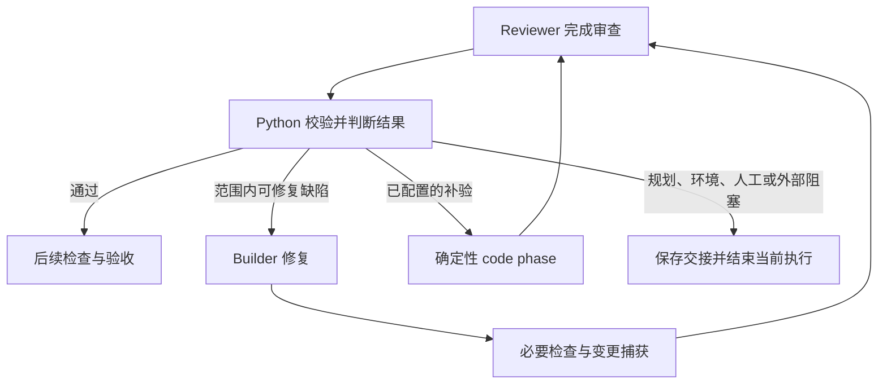

# SSSF Reviewer 问题归属与工作流分流设计

状态：第一版已实现。结构化合同与门禁、共享分流、两个 review 工作流、生成器和显式补证复核入口均已接入；确定性测试 112 项通过。
日期：2026-09-23。

## 1. 目标与范围

Reviewer 根据审查证据区分实现缺陷、验证缺口、规划冲突和外部阻塞，Python 工作流根据结构化结果决定修复、补验或结束并交接。

本项目 reviewer 提示词已吸收阻塞准入标准、证据审查、最小充分证据及 ticket/整体集成边界。本设计继续补齐问题归属和工作流处理能力，沿用现有角色、工作项绑定、检查阶段与验收所有权。

第一版范围：

- 结构化阻塞项与一致性校验。
- 当前范围内实现缺陷的有界修复，以及已配置检查的有界补验。
- 规划、环境、人工验证和外部问题的明确交接。
- 两个现有 review 工作流及 ADW 生成器的分支适配。
- 环境或人工证据补齐后的显式复核入口。
- 规划文档原位修订，以及文档内的数字 revision 计数（已实现）。

运行挂起、自动唤醒、持久化执行位置和通用断点续跑列入后续能力。第一版通过结束当前执行并保留可追溯交接支持后续继续。

## 2. 当前行为与适配

下列路径以 `.agents/skills/sssf/` 为基准。

| 位置 | 当前行为 | 适配要求 |
|---|---|---|
| `templates/adws/adw_modules/data_types.py` | `ReviewOutput` 包含 `approved`、逐项需求判断 `findings`、字符串列表 `blocking` | 为阻塞项增加可供代码消费的类型和解除条件 |
| `templates/adws/adw_modules/agents.py` | 收到 `status="fail"` 后保存信封并抛异常，阶段终止 | 正常完成的问题分类必须通过业务结果交给 ADW |
| `templates/adws/adw_modules/gates.py` | `verdict_consistent` 检查批准、未满足需求和阻塞列表的自洽性 | 同步检查结构化阻塞项及结论一致性 |
| `templates/adws/adw_build_review.py` | 拒绝后在次数上限内调用 builder | 先判断问题归属，再决定是否修复 |
| `templates/adws/adw_simple_sdlc.py` | 拒绝后调用 builder，修复后补跑测试；通过才提交 | 接入分流并保留检查与提交约束 |
| `scripts/make_adw.py` | 累计 `previous.approved` 并顺序执行后续阶段 | 通过时继续交付，拒绝或阻塞时保存原因并结束 |
| `templates/adws/adw_modules/runner.py` | `run.finish()` 以成功/失败结束运行 | 第一版以未验收结束表达业务阻塞，记录具体原因 |
| `templates/adws/adw_modules/tickets.py` | 使用固定 `.tickets/` 目录，按内容哈希绑定输入；发布时刷新索引并保存 session 发布记录 | 分流后的规划修订使用新 session，重新绑定修改后的定义 |
| `templates/prompt_engineering/planner/`、`templates/prompt_engineering/decomposer/` | 在固定路径维护当前文档，每次修订将文档内 revision 加 1 | 交接中传递原审查问题及修订影响 |

复用 `adw_id` 会保留 session 上下文；Python 脚本从入口执行，由 ADW 明确安排阶段。相关边界见 [Ticket 合同](../.agents/skills/sssf/references/tickets.md) 和 [ADW 修改约定](../.agents/skills/sssf/cookbooks/update_adw.md)。

## 3. 输出合同与职责

### 3.1 结构化阻塞项

保留 `findings` 的逐项需求判断含义，包含满足和未满足的需求。将 `blocking` 从字符串列表改成结构化条目，每条表示一个独立问题，至少能表达：

- 问题类型与具体缺口。
- 对应需求、公共合同或显式验证义务。
- 现实触发路径、后果与证据；验证缺口说明现有证明为何不足。
- 最低充分解除条件与必要交接信息。
- 涉及集成问题时，指出受影响 ticket 和失效证据。

普通建议、Optional Smoke 和可接受的残余风险记录在报告的建议与风险说明中；阻塞列表记录验收前需要解除的问题。

Python 以结构化阻塞项和已配置的工作流能力作为路由依据。`notes_for_next_agent` 承载问题解释和交接背景。实现采用 `ReviewBlocker`、`ReviewObligation`、`ReviewDecision`、`ReviewReceipt` 与 `RecheckRequest`，输出合同与消费方使用同一套结构化定义；具体枚举和参数见 [运行操作合同](../.agents/skills/sssf/references/reviewer-routing.md)。

### 3.2 审查完成与目标通过

正常完成审查，包括明确识别规划冲突、环境缺口或人工验证待办时：

- `status="success"` 表示审查和问题分类已经完成。
- `approved=false` 表示当前审查目标尚未获批。
- 结构化阻塞项说明原因、依据和解除条件。

`status="fail"` 表示审查执行失败，沿用现有运行时终止语义。SDK、权限、超时、取消和运行错误由运行时错误路径保存和处理。

报告分别记录已证实的实现缺陷和待确认的行为。人工验证或环境条件缺口应说明待验证义务、所需条件及其对验收的影响；需求判断以实际证据为依据。

### 3.3 一致性门禁

扩展 `verdict_consistent`，至少保证：

- 批准时，需求判断全部满足、阻塞列表为空，当前审查负责的强制验证义务已经完成。
- 拒绝由具体阻塞问题或待确认的强制义务支撑，并给出对应依据。
- 阻塞类型、描述和交接信息相互一致，必要字段完整。
- gate 验证可机械判断的结构和一致性；reviewer 判断触发路径的可信度和证据的充分性。

数据类型、提示词报告示例、`output_type=` 调用点及其消费方必须同步更新。

## 4. 分流规则

| 审查结果 | 当前执行的处理 | 后续责任 |
|---|---|---|
| 通过 | 继续后续检查和验收 | ADW |
| 当前范围内实现缺陷 | 进入有界修复循环 | builder |
| 验证缺口：缺少必要测试实现或需要调整代码/fixture | 交回当前目标的 builder | builder 修复后由相应阶段验证 |
| 验证缺口：已有检查需要执行 | 进入已配置的确定性 code phase | 执行后交 reviewer 判断证据 |
| 根需求、公共语义或兼容合同冲突 | 保存交接，结束当前执行 | planner |
| 根合同不变，ticket 范围、AC 分配、依赖、profile 或验证责任冲突 | 保存交接，结束当前执行 | decomposer |
| 环境缺失 | 保存未运行项目、影响及解除条件，结束当前执行 | 环境责任方解除后复核 |
| Required Manual Validation 待完成 | 保存前提、步骤、通过标准及待办原因，结束当前执行 | 人工提供证据后复核 |
| 外部回归或协议问题 | 保存证据并停止，指出责任范围 | 对应责任方处理 |
| Optional Smoke、普通建议 | 记录残余风险，证据充分时允许通过 | 按需后续处理 |

第一版在识别规划问题后保存交接并结束当前执行。交接包含具体问题、影响范围、必要决策和原审查引用；后续通过显式规划调用，由 planner 或 decomposer 按职责完成修订。

混合问题保留全部条目，并按归属逐项确定处理责任。存在根合同冲突时，优先完成合同交接和修订。自动修复或补验的准入条件是当前目标、权限和工作流能力足以闭合相关问题。

补验使用已配置、明确的执行入口。工作流所需检查能力待补齐时，报告能力缺口、待执行检查和责任方，保存交接并结束。检查记录以实际执行结果为依据。

## 5. Review 循环适配

循环规则：

- 每次实际调用 builder 消耗一次修复次数。
- 补验使用独立的次数上限；确认环境阻塞后保存解除条件并结束，条件补齐后通过复核入口继续。
- gate 格式/一致性纠正、JSON 修复和业务修复/补验保持现有职责区分。
- builder 修复后重新捕获实际变更；必要检查必须适用于修复后的代码。
- 所有分支沿用同一个有效审查目标；范围调整通过规划修订和新绑定明确生效。
- 提交、交付文档和验收记录签发以审查通过及强制义务全部满足为准入条件。

共享分流规则放入 `adw_modules/`，ADW 脚本保留阶段顺序、分支和验收决策。同步适配 `adw_build_review.py`、`adw_simple_sdlc.py` 与 `make_adw.py`。生成器产出的一次性骨架在通过时继续交付，在拒绝或阻塞时保存原因并结束；完整修复循环由配置该能力的 ADW 提供。

## 6. 结束、交接与继续

### 6.1 第一版结束方式

业务阻塞通过 `run.finish(accepted=False, reason=...)` 结束当前执行，保存结构化审查结果和准确原因，并释放运行资源。

当前数据库和 UI 以成功/失败记录运行结果。等待人工或环境的业务阻塞以本次未验收结束呈现，审查报告和 trace 保存具体原因及后续继续所需的条件。

### 6.2 规划发生变化

根 spec、ticket-set 和单张 ticket 已统一采用以下修订规则：

- planner 在固定 `spec_path` 维护当前根 spec；decomposer 在对应的固定 `.tickets/` 目录维护当前 `ticket-set.md` 和 `tickets/*.md`。每次修订直接更新对应文件。
- 每份文档在 frontmatter 内记录一个整数 `revision`，初始值为 1；每次完成一次修订，该文档的 revision 加 1，包括文案和展示顺序调整。内容保持原样的文档沿用当前 revision。
- 规划角色负责维护文档内的 revision、稳定需求标识和 ticket ID，并在交接中说明受影响的工作与证据。
- 运行时通过路径和内容哈希绑定定义，派生索引反映当前文档的元数据。

拆解运行时已实现的流程：

1. `prepare_decomposition` 绑定根 spec 的内容哈希和固定输出目录。新 session 可以读取原目录中的现有文档并开展修订。
2. `publish_decomposition` 核对来源和输出目录，刷新当前 `index.json`，将索引路径与哈希保存到 session 的 `decomposition-published.json`。
3. 发布记录标记本 session 的拆解已完成。后续修订使用新 session，继续更新原路径文档；宿主负责发布记录及绑定文件的写入和保护。

Reviewer 规划交接按以下流程接入：

1. 保存原审查问题并结束当前实现执行，交由对应规划角色在新的规划 session 中原位修订文档。
2. 完成规划发布和受影响索引的刷新，在新的实现 session 中按当前文件内容绑定 `work_item`。
3. 引用原审查问题，核对历史证据对新目标及当前基线的适用性，再安排实施和审查。

定义变化会使旧内容哈希绑定失效。新 session 的输入校验确认当前目标身份、定义和基线；reviewer 在这些校验成立后判断证据是否充分。

原位修订已落实到运行时、角色提示词和 Ticket 合同；Reviewer 的结构化分流与 `adw_recheck.py` 补证复核入口现已接入。

### 6.3 只补齐环境或人工证据

提供显式复核入口，输入原审查/目标引用、当前基线以及新增证据或已解除条件。入口先核对目标身份、定义和证据适用性，再执行必要检查并调用 reviewer。实现内容保持原样的补证任务直接进入检查和审查阶段。

目标定义已变化则转入新的规划绑定；代码或配置变化使旧证据失效时，补齐受影响验证。复核通过后仍由 ADW 确认当前所有验收义务，才能签发验收记录。

显式复核作为新的受控执行路径，由入口明确安排校验、检查、审查和验收阶段。

## 7. 实施顺序

规划原位修订、文档内 revision 计数、固定输出目录、索引发布及 session 绑定作为基础能力保留。以下三步均已完成：

1. **输出合同与门禁**：定义结构化阻塞类型，更新 reviewer system/user 提示词、报告示例、`ReviewOutput` 及 `verdict_consistent`，核对所有调用和消费位置。
2. **共享分流与 ADW**：增加确定性分流处理，适配两个 review 工作流和生成器，落实结束条件、修复与补验上限，以及提交前的验收条件；规划交接接入现有原位修订流程。
3. **复核入口与说明**：实现补证后的显式复核入口，核对绑定和基线，补齐工作流操作文档及相关测试。

改动位于工厂分发模板和生成器。已有安装按现有更新机制显式合并提示词与 ADW，保留用户定制；更新后的配置、输出和消费方共同满足新合同。

## 8. 验收标准

- 实现缺陷进入 builder 修复；只缺已配置检查执行时进入 code phase。
- 规划冲突、环境阻塞、人工待验证、外部回归和协议问题按归属保存交接，由对应责任方处理。
- 混合阻塞保留完整问题列表；根合同冲突优先交接规划角色，合同明确后再安排实施。
- Optional Smoke 和普通建议记录为建议与残余风险；必需人工验证完成并提供充分证据后满足相应验收义务。
- 审查已完成但目标未通过时，业务分类能到达 ADW；审查执行失败仍保留现有失败语义。
- gate 校验结论与阻塞项的一致性，并将校验问题交给有界纠正流程；数据类型、提示词示例和调用点保持一致。
- 修复和补验次数有界；检查结果必须适用于实际最终代码。
- 两个现有工作流及生成链均以审查通过和强制义务完成作为提交及正常交付的准入条件。
- 根 spec、ticket-set 和单张 ticket 在固定路径维护当前内容；文档内 revision 从 1 开始，每次修订加 1，包括文案调整。
- 规划修订后刷新受影响索引、保存 session 发布记录，并在新实现 session 中绑定当前定义；补证复核检查身份、定义、当前基线及证据适用性。
- 结束原因可在审查报告和 trace 中追溯，运行资源正常释放。

测试以输出合同、分流行为、工作流调用序列和继续执行的边界为重点，使用现有确定性测试设施。按仓库要求，所有测试提权执行。各项能力的交付状态以实际实现和对应验证结果为依据；当前已实现范围见文首状态及下面的交付记录。

## 9. 第一版交付记录

- `ReviewOutput.blocking` 使用结构化条目，新增 `required_verification` 记录本次审查负责的强制义务。`verdict_consistent` 校验类型、归属、依据和结论；`obligations_retained` 防止修复或复核时遗漏原有需求与强制义务。
- `adw_modules/review_routing.py` 统一归属和分流规则。两个 review 工作流分别允许最多 3 次 builder 修复、2 次补验；生成器保存拒绝原因并立即停止后续阶段。
- `quality.check_specs()` 提供明确的检查 ID 与 argv 注册表。占位命令不算已配置能力，也不能通过验证。实际检查结果附带输入指纹；代码或配置变化后，旧结果会失去适用性。
- 每个分流阶段保存不可变的 `review-routing/<phase-seq>.json`，包含完整问题、报告副本、目标、基线、解除条件和决策；trace 保存文件位置及结束原因。交接文件纳入宿主写保护。
- `adw_recheck.py` 使用新 session，校验原交接引用、目标定义、当前 HEAD 和新增证据，按需执行已配置检查后调用 reviewer；不调用 builder。规划冲突或定义变化需先进入新的规划与实现绑定流程。
- 本版不提供挂起/自动唤醒/通用断点续跑，也不由 starter 工作流自动签发 ticket 验收记录；相关所有权与现有 Ticket 合同一致。
- 验证：按仓库要求提权运行 `python -m pytest -q tests`（使用 README 所列 uv 依赖），112 项通过；`git diff --check` 通过。测试覆盖输出合同、业务拒绝与执行失败的区别、gate 纠正、全部分流归属、混合阻塞、独立预算、工作流阶段顺序、提交限制、生成链中止、复核边界、过期证据和宿主交接保护。

具体使用及既有安装的显式合并步骤见 [Reviewer routing and explicit recheck](../.agents/skills/sssf/references/reviewer-routing.md)。
